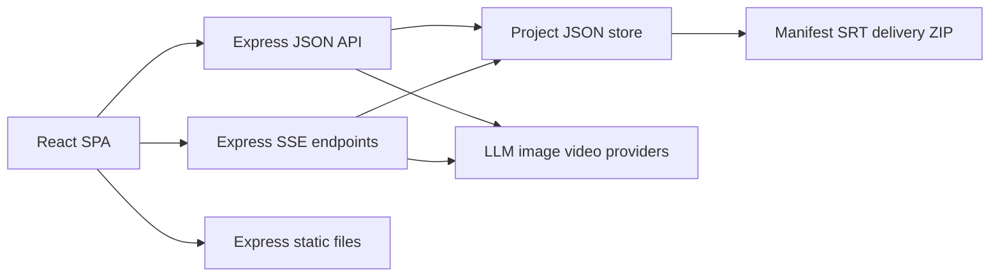
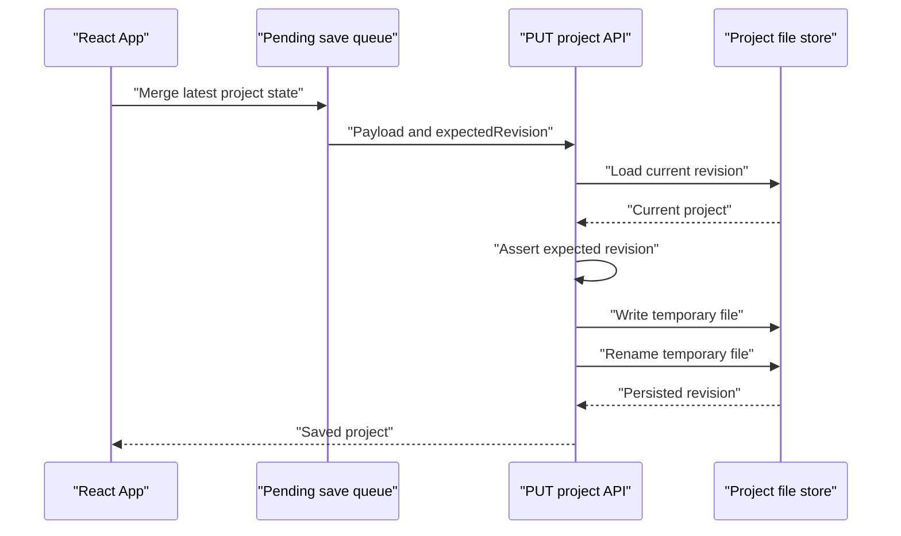

# 系统架构

## 概述

短剧脚本工坊是一个将小说、故事或剧本转换为制作分析、角色设定、场景设定、分镜、短剧脚本、视觉资产和漫画脚本的单用户 Web 应用。创作者可以使用全文、全部章节或单章作为分析范围，并通过文本、图像和视频 Provider 完成从内容分析到交付归档的流程。

系统采用单进程 Express 服务与 React SPA。Express 同时提供静态资源、JSON API、SSE 分析流、Provider 代理调用和本地项目文件存储；React 负责编辑状态、保存队列、冲突合并、任务轮询和生产操作界面。

生产工作流围绕两个版本号组织：`revision` 表示项目每次成功持久化后的版本，`sourceRevision` 表示内容、章节、知识库或视觉风格等上游输入的版本。角色、场景、分镜和漫画格使用稳定实体 ID，使任务、资产和连续性信息在重命名与排序后仍能定位原实体。

## 技术栈

| 类别 | 技术 | 用途 |
|------|------|------|
| 运行时 | Node.js 18+ | 服务端运行环境与内置测试运行器 |
| 服务端 | Express 4.18 | 静态资源、JSON API、SSE 和中间件 |
| 前端 | React、React DOM | 单页应用和状态管理 |
| UI | `animal-island-ui` | Button、Input、Modal、Tag 等组件 |
| 存储 | Node.js `fs` 与 JSON 文件 | 项目、快照、任务、资产和 Provider 配置持久化 |
| 网络 | Node.js `fetch`、`AbortSignal` | LLM、图片和视频 Provider 调用 |
| 测试 | `node:test`、`node:assert/strict` | 核心生产工作流单元测试 |
| 归档 | 自实现 ZIP store writer | 生成不压缩的交付 ZIP |

## 项目结构

```text
workspace/
├── server.js
├── package.json
├── public/
│   └── js/
│       ├── app.jsx
│       └── api.js
├── test/
│   └── server.test.js
├── data/
│   └── projects/
│       └── <project-id>.json
└── .monkeycode/
    ├── specs/production-workflow/
    └── docs/
```

`server.js` 是服务端入口。服务在非测试环境监听 `0.0.0.0`，默认端口为 `3456`，并将 `public/` 作为静态目录。`public/js/app.jsx` 是主界面和生产工作流状态协调器，`public/js/api.js` 统一封装 JSON 与 SSE 请求。

## 运行架构



### React SPA

前端维护项目列表、当前项目、分析范围、保存状态和媒体轮询状态。`normalizeProject` 为加载到浏览器的历史结构补默认生产字段和实体 ID；服务端仍是持久化时的权威规范化入口。

### API 与业务逻辑

Express 路由和领域函数集中在 `server.js`。主要职责包括项目 CRUD、章节和知识库、分析、任务和资产、Provider 配置、快照、字幕与交付导出。

### 文件存储

项目文件位于 `data/projects/<project-id>.json`。项目 ID 经过字符白名单和 `..` 检查后再参与路径构造。项目加载会调用 `normalizeProject`，历史项目因此在内存中获得缺失的生产字段和稳定 ID。

### Provider 集成

文本 Provider 使用 OpenAI 风格的 `/chat/completions`；图片 Provider 使用 `/images/generations`；视频任务使用 `/videos` 创建，并通过 Provider 查询接口轮询。所有 Provider URL 在调用前经过协议、凭据、网络地址和可选主机白名单校验。

## 项目数据模型

```json
{
  "id": "proj_x",
  "revision": 4,
  "sourceRevision": 2,
  "content": "...",
  "chapters": [],
  "knowledge": {
    "characters": [],
    "scenes": [],
    "props": [],
    "timeline": []
  },
  "results": {},
  "preprocess": {},
  "assets": [],
  "jobs": [],
  "analysisRuns": [],
  "snapshots": []
}
```

### `revision`

`saveProject` 读取当前磁盘版本，校验调用方提供的 `expectedRevision`，然后将新版本设置为当前磁盘 `revision + 1`。创建项目时对象初始值为 `0`，首次 `saveProject` 后持久化版本为 `1`。冲突返回 HTTP 409，并附带最新 `revision` 和完整服务端项目。

### `sourceRevision`

`PUT /api/projects/:id` 比较 `style`、`content`、`chapters` 和 `knowledge`。任一上游字段发生变化且请求未显式提供 `sourceRevision` 时，服务端将其递增。前端在编辑 `content`、`style` 或 `chapters` 时也会立即递增本地来源版本，并将已有结果和资产标记为 `stale`。

分析结果可携带 `derivedFromRevision`，任务和资产保存创建时对应的 `sourceRevision`。这些字段让界面和交付数据能够判断产物来源。

## Revision 保存流程

前端将当前项目的完整规范化状态放入 `pendingProjects`，以项目 ID 为键维护独立保存队列。普通编辑触发 600ms 防抖；切换项目、创建任务和更新任务前会先刷新待保存状态。



并发冲突时，前端使用 `mergeProjectState(serverProject, localPayload)` 合并状态：含 ID 的对象数组按 ID 合并，本地同 ID 项覆盖服务端项；普通数组保留本地值；对象递归合并；标量优先使用已定义的本地值。合并后的项目使用服务端最新 revision 再保存一次。重试失败时，本地待保存状态继续留在队列中，界面显示 `conflict` 或 `failed`。

服务端保存先写入 `<project-file>.<pid>.<id>.tmp`，写入成功后调用 `renameSync` 替换目标项目文件。该方式避免目标 JSON 暴露为部分写入状态。

## 稳定实体 ID

`normalizeProject` 为以下实体补 ID：

| 实体 | 前缀 | 位置 |
|------|------|------|
| 角色 | `char_` | `knowledge.characters`、`results.characters.characters` |
| 场景 | `scene_` | `knowledge.scenes`、`results.scenes.scenes` |
| 分镜 | `shot_` | `results.storyboard.shots` |
| 漫画格 | `panel_` | `results.manga.pages[].panels` |

已有 ID 会原样保留。规范化过程还通过名称与别名建立角色和场景索引，将旧分镜和漫画格中的名称引用迁移为 `characterIds` 与 `sceneId`。任务目标由 `entityType + entityId` 定位，支持 `project`、`character`、`scene`、`shot`、`panel` 和 `mangaPanel`。

当前实现对漫画页本身未在服务端补稳定 ID；生产任务目标覆盖漫画格。结构化分块合并会重新计算分镜 `shotNo`、漫画 `pageNum` 和 `panelNum`，实体 ID 承担排序变化后的身份关联。

## Jobs 与 Assets

### Job

任务创建后立即写入项目 `jobs`。核心字段如下：

| 字段 | 含义 |
|------|------|
| `id` | `job_` 前缀的任务 ID |
| `entityType`、`entityId` | 稳定目标实体 |
| `type`、`kind` | 任务与资产类型 |
| `status` | `pending`、`processing`、Provider 状态、`completed` 或 `failed` |
| `providerTaskId` | 外部视频任务 ID |
| `params` | Prompt、尺寸、帧数、参考图等重试参数 |
| `sourceRevision` | 创建任务时的上游版本 |
| `progress`、`error` | 进度和失败原因 |
| `assetId`、`url` | 完成后绑定的资产 |

刷新或重新加载项目后，前端筛选未结束的视频任务并恢复轮询。轮询成功后通过任务 PATCH 同时更新任务、创建资产并写入目标实体；失败状态和错误也持久化。

### Asset

`attachAsset` 将完成任务转换为统一资产记录：

| 字段 | 含义 |
|------|------|
| `id` | `asset_` 前缀的资产 ID |
| `entityType`、`entityId` | 来源实体 |
| `kind` | `image`、`keyframe`、`video` 等 |
| `url` | Provider 返回的媒体地址 |
| `prompt`、`model`、`params` | 生成谱系 |
| `sourceRevision` | 生成任务来源版本 |
| `parentAssetId` | 视频对应关键帧等父资产 |
| `createdAt` | 创建时间 |

项目级资产追加到 `results.media`。角色、场景和漫画格写入图像引用；分镜视频写入 `videoAssetId` 与 `videoUrl`；分镜关键帧写入 `keyframeAssetId`、`keyframeUrl` 和 `imageUrl`。同一任务已有 `assetId` 时重复完成操作复用原资产，避免重复追加。

## 分块分析与恢复

### 预处理

`/api/preprocess` 默认按约 3000 字拆分。`splitText` 优先识别中文章节标题、`Chapter N`、数字标题和书名号式标题；超长段落按长度切片。每段独立生成摘要，单段失败会保存占位摘要并继续，最后综合为全局角色、场景、时间线、冲突和主题。

预处理保存 `contentHash`、`sourceMode`、`chapterId` 和 `createdAt`。后续分析仅在内容哈希和范围完全匹配时注入预处理上下文，避免复用过期摘要。

### 单模块结构化分析

角色、场景、分镜和漫画属于结构化模块。输入超过 12000 字时，`generateStructured` 分块调用模型：角色和场景数组直接合并，分镜合并后重新编号，漫画页与格重新编号。项目模式下每个分块将检查点写入 `analysisRuns`，记录已完成块数、总块数、部分结果、失败块和错误。

### 批量分析

批量执行顺序固定为结构、制作分析、角色、场景、分镜、脚本、视觉资产、漫画。角色和场景结果会注入后续分镜与漫画 Prompt。`analysisRuns.modules` 保存每个模块的处理状态；通过 `resumeRunId` 恢复时，已完成模块直接跳过，失败模块可重新执行。

单章分析同时更新项目聚合结果与目标章节的 `chapter.analysis[type]`，章节产物携带 `derivedFromRevision`。

## 镜头连续性

关键帧生成会定位当前稳定 `shot.id` 的前一镜头，并组合以下上下文：

- 前一镜头的 `continuityNote` 或 `notes`。
- 前一镜头的画面、动作、角色状态和场景状态。
- 前一镜头关键帧 URL。
- 当前镜头涉及的角色设定图与场景设定图。
- 当前角色外貌、服装及场景环境、灯光、氛围描述。

视频生成可将当前关键帧作为输入，并在生成资产中通过 `parentAssetId` 记录父关键帧。`/api/check-consistency` 将知识库与各分析模块交给 LLM，规范化为 `error`、`warning`、`info` 三种严重级别以及 `open`、`resolved`、`accepted` 三种状态。开放的 `error` 计入 `blockingCount`，前端在一致性区域显示阻断数量。

## 交付 ZIP

`buildDeliveryZip` 使用 store 模式写入 ZIP，本身不压缩文件。归档内容如下：

```text
delivery.zip
├── manifest.json
├── project.json
├── project.md
├── assets-manifest.json
└── subtitles/
    └── episode-<number>.srt
```

`manifest.json` 包含项目 revision、sourceRevision、风格、更新时间、角色、场景、分镜、漫画页、资产、任务和分析运行。`assets-manifest.json` 保存资产谱系字段。字幕按集生成，每集时间轴从零开始；无字幕镜头仍推进时间，从而保持后续字幕与画面时长一致。

ZIP 中的资产清单保存 URL 与元数据，远程图片和视频文件本体不进入归档。归档完整性依赖 ZIP 条目 CRC32、项目 JSON 和 manifest 中的版本与实体信息。

## 安全边界

- Express JSON 请求体限制为 10 MB。
- 分析文本默认限制为 300000 字和 100 个分块，超限返回 HTTP 413。
- 预处理、分析、图片和视频请求共享昂贵请求并发限制，默认 4，超限返回 HTTP 429。
- `APP_ACCESS_TOKEN` 启用后保护全部 `/api` 路由，接受 Bearer token 或 `x-app-token`。
- Provider URL 拒绝内嵌用户名和密码；生产环境要求 HTTPS 并拒绝 localhost 与私网地址。
- `PROVIDER_ALLOWED_HOSTS` 可将 Provider 主机限制为逗号分隔的精确主机列表。
- Provider API Key 在配置读取和保存响应中以首尾片段加 `****` 返回；保留掩码值时服务端继续使用已保存密钥。
- Provider base URL 变化时必须同时提交真实 API Key，避免旧凭据被静默发送到新主机。

## 已验证属性

`test/server.test.js` 覆盖文本限制、可选访问令牌、并发限制、Provider URL 校验、Provider 字段白名单与密钥保留、稳定实体 ID、revision 冲突、任务目标解析、资产绑定、逐集 SRT、ZIP 目录结构、前镜头连续性、结构化一致性问题和预处理范围匹配。
