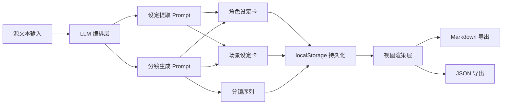

# 短剧脚本工坊 (ShortDrama Studio)

Feature Name: novel-to-shortdrama-script
Updated: 2026-07-08

## 描述

一个纯前端单页应用，将小说 / 故事 / 剧本文本转化为可用于 AI 视频生成的短剧分镜脚本与设定文档。用户在前端配置自有 LLM API Key，系统调用兼容 OpenAI 格式的模型，自动提取角色与场景设定，并生成含中英文 AI 视频提示词的分镜脚本。产出可页面内编辑并导出为 Markdown / JSON。

## 架构

采用零构建工具的纯前端架构，所有逻辑运行在浏览器中，便于静态托管与本地预览。



### 文件结构

```
/
├── index.html              # 单页应用入口
├── css/
│   └── styles.css          # 全局样式
├── js/
│   ├── app.js              # 入口、事件绑定、视图切换
│   ├── store.js            # 状态管理与 localStorage 持久化
│   ├── llm.js              # LLM 调用与 Prompt 模板
│   ├── render.js           # 视图渲染(角色/场景/分镜)
│   ├── export.js           # Markdown / JSON 导出
│   └── example.js          # 内置示例项目数据
└── .monkeycode/
    └── specs/novel-to-shortdrama-script/
        ├── requirements.md
        └── design.md
```

## 组件与接口

### store.js — 状态管理

```js
// 项目状态结构
const state = {
  projects: Project[],     // 所有项目
  currentId: string,       // 当前项目 id
  view: 'characters' | 'scenes' | 'shots',
  generating: boolean,
  error: string | null
}

// 主要接口
loadProject(id)            // 加载指定项目
saveProject()              // 持久化当前项目到 localStorage
createProject(name)        // 新建项目
deleteProject(id)
updateField(path, value)   // 通用字段更新(支持编辑)
```

### llm.js — LLM 编排

```js
callLLM(messages, opts)           // 通用 OpenAI 兼容请求，返回文本
testConnection(config)            // 发送最小请求验证配置
generateSettings(sourceText)      // 返回 { characters, scenes }
generateShots(sourceText, settings, params)  // 分批返回 Shot[]

// 内部 Prompt 模板
SETTINGS_PROMPT(sourceText)
SHOTS_PROMPT(chunk, characters, scenes, params)
```

- 使用 `fetch` 调用 `{baseUrl}/v1/chat/completions`
- 请求头携带 `Authorization: Bearer {apiKey}`
- 通过指令约束 LLM 仅返回 JSON，并在解析失败时尝试 `JSON.parse` 容错提取
- 超时控制：单请求 90s，使用 `AbortController`

### render.js — 视图渲染

```js
renderConfig()             // 渲染配置面板
renderCharacters()         // 渲染角色卡网格(可编辑)
renderScenes()             // 渲染场景卡网格(可编辑)
renderShots()              // 渲染分镜(表格/网格切换)
renderProjectBar()         // 项目切换栏
```

- 所有可编辑字段使用 `contenteditable` 或内联 `input`，失焦即保存
- 分镜表格支持按集号 / 场景筛选下拉框

### export.js — 导出

```js
exportMarkdown(project)    // 生成 Markdown 字符串并触发下载
exportJSON(project)        // 生成 JSON 并触发下载
copyToClipboard(text)      // 复制单条 prompt
```

## 数据模型

```ts
interface Project {
  id: string
  name: string
  sourceText: string
  createdAt: string
  updatedAt: string
  config: Config
  characters: Character[]
  scenes: Scene[]
  shots: Shot[]
}

interface Config {
  apiKey: string
  baseUrl: string
  model: string
  episodes: number        // 总集数
  durationPerEp: number   // 每集时长(秒)
  style: string           // 视频风格，如"电影感/古风/赛博朋克"
  aspectRatio: string     // 16:9 | 9:16 | 1:1
  batchSize: number       // 单次请求分镜上限
}

interface Character {
  id: string
  name: string
  gender: string
  age: string
  appearance: string
  personality: string
  costume: string
  imagePromptZh: string
  imagePromptEn: string
}

interface Scene {
  id: string
  name: string
  environment: string
  mood: string
  lighting: string
  timeOfDay: string
  imagePromptZh: string
  imagePromptEn: string
}

interface Shot {
  id: string
  episode: number
  sceneNo: number
  shotNo: number
  shotType: string        // 景别: 远/全/中/近/特写
  visual: string          // 画面描述
  dialogue: string
  action: string
  duration: number        // 秒
  characterIds: string[]
  sceneId: string
  promptZh: string
  promptEn: string
}
```

## 正确性属性

- 分镜 `characterIds` 中的每个 id 必须存在于 `characters` 数组中
- 分镜 `sceneId` 必须存在于 `scenes` 数组中
- 同一(集号, 场号)下的镜号 `shotNo` 唯一且递增
- `duration` 为正数，单集所有分镜时长之和不超过 `durationPerEp` 的 110%(允许小幅溢出)
- `episodes`、`durationPerEp`、`batchSize` 均为正整数

## 错误处理

| 场景 | 处理策略 |
|------|---------|
| API Key 为空 | 禁用生成按钮，配置区显示提示 |
| 连接失败 / 网络错误 | 在生成按钮附近显示错误信息，允许重试 |
| LLM 返回非 JSON | 尝试用正则提取 `{...}` / `[...]` 段并解析；失败则记录原始返回并提示"模型输出格式异常，请重试" |
| 请求超时(90s) | 中止请求，提示超时并建议减小 `batchSize` 或缩短源文本 |
| localStorage 配额满 | 捕获 `QuotaExceededError`，提示用户清理旧项目 |
| 分批生成部分失败 | 已成功的批次保留，失败批次标记为待重试，不影响已生成内容 |

## 测试策略

- **手动测试**：覆盖主要流程(配置→生成设定→生成分镜→编辑→导出)
- **单元测试**(可选，通过浏览器控制台运行)：
  - `exportMarkdown` 输出格式校验
  - 数据模型校验函数(关联 id 一致性、镜号唯一性)
  - JSON 容错解析
- **LLM 调用**：通过 mock fetch 测试 Prompt 组装与分批合并逻辑
- **示例数据**：内置示例作为回归基准，验证渲染与导出

## 关键设计决策

1. **纯前端无后端**：部署简单，适配单端口预览环境；用户自带 Key，符合凭据隔离原则
2. **localStorage 持久化**：免登录、免数据库，满足单用户本地工具需求
3. **分批生成**：长文本按段落切分，单批不超过 `batchSize`，避免单次输出过长导致截断
4. **设定注入分镜 Prompt**：生成分镜时将角色外貌与场景环境描述注入上下文，保证画面一致性
5. **中英文双 prompt**：满足国内(可灵)与海外(Sora/Runway)模型使用场景
