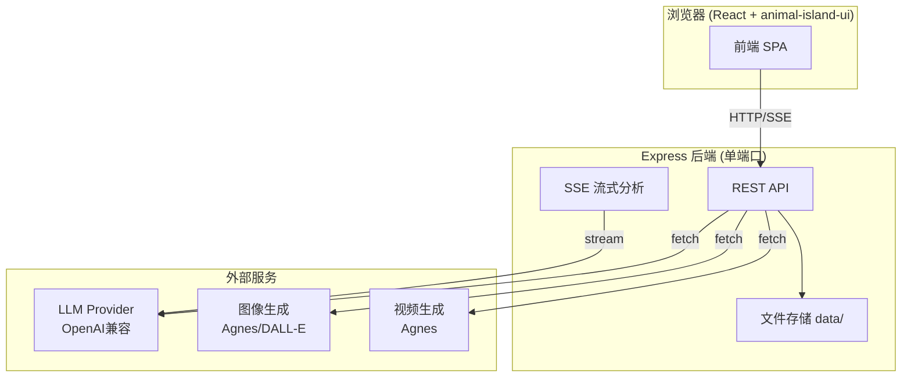

# 整合优化设计文档 — 短剧脚本工坊 v3.0

Feature Name: novel-to-shortdrama-script
Updated: 2026-07-08

## 背景

基于两个半成品附件（zip1 v2.1.1、zip2 v2.0.0）的优点，整合优化当前纯前端项目，升级为 Node+Express+React 全栈架构，UI 采用 animal-island-ui 组件库。

## 吸收的优点

| 来源 | 优点 | 整合方式 |
|------|------|---------|
| zip1 | 10 种视觉风格系统（promptSuffix + negativePrompt） | 移植到后端 STYLES，注入所有生图/视频 Prompt |
| zip1 | 8 个分析模块（结构/制作/角色/场景/分镜/脚本/资产/漫画） | 移植 PROMPTS，支持单独/批量流式生成 |
| zip1 | 知识库（角色/场景/道具提取+合并+去重） | 章节分析前自动提取，跨章节保持一致性 |
| zip1 | 章节管理（正则分章、分组、逐章分析） | 移植章节导入与树形管理 |
| zip1 | 预处理引擎（分段摘要+全局综合） | 长文本先预处理再分析 |
| zip1 | 一致性检查 | 全模块生成后 QA |
| zip1 | AI 生图/生视频（Agnes/DALL-E） | 移植媒体生成 API |
| zip1 | 流式 SSE + 重试退避 | 所有 LLM 调用走 SSE |
| zip1 | 版本快照 | 移植快照保存/恢复 |
| zip2 | 预设 Provider 列表 | 配置页提供 deepseek/qwen/openai/mimo 预设 |
| zip2 | Prompt 覆盖配置 | 高级设置可自定义各模块 Prompt |
| 当前项目 | 结构化分镜（Shot 含 episode/sceneNo/shotNo/中英文prompt） | 分镜模块输出结构化 JSON 而非纯 Markdown |
| 当前项目 | 批量分块+id 重映射 | 长文本分镜自动分块合并 |
| 当前项目 | 悬疑示例数据 | 内置示例项目 |

## 架构



### 文件结构

```
/
├── server.js                # Express 后端（API + 静态服务）
├── package.json
├── public/
│   ├── index.html           # React 入口（CDN + Babel）
│   ├── css/
│   │   └── app.css          # animal-island-ui token + 自定义样式
│   └── js/
│       ├── app.jsx          # React 根组件
│       ├── api.js           # 前端 API 封装
│       ├── components/
│       │   ├── Sidebar.jsx
│       │   ├── InputPanel.jsx
│       │   ├── ResultPanel.jsx
│       │   ├── Settings.jsx
│       │   ├── KnowledgeBase.jsx
│       │   ├── MediaGen.jsx
│       │   └── ShotTable.jsx
│       └── example.js       # 示例数据
└── .monkeycode/specs/novel-to-shortdrama-script/
    ├── requirements.md
    └── design.md
```

## 后端设计

### 视觉风格（STYLES）

10 种风格，每种含 `promptSuffix`（英文风格描述）和 `negativePrompt`（排除项），自动追加到所有生图/视频 Prompt。

### 分析模块（ANALYSIS_MODULES）

| 模块 | 输出格式 |
|------|---------|
| structure | Markdown 剧情结构分析 |
| summary | Markdown 制作分析 |
| characters | 结构化 JSON 角色设定卡（含中英文 imagePrompt） |
| scenes | 结构化 JSON 场景设定卡（含中英文 imagePrompt） |
| storyboard | 结构化 JSON 分镜（含中英文 videoPrompt） |
| script | Markdown 短剧脚本 |
| assets | Markdown 视觉资产 |
| manga | Markdown 漫画脚本 |

characters/scenes/storyboard 三个模块输出结构化 JSON（沿用当前项目数据模型），其余输出 Markdown。

### LLM 调用

- 统一 `callLLM(systemPrompt, userContent, stream)` 兼容 OpenAI 格式
- 流式 SSE：逐 token 推送到前端
- `withRetry`：指数退避，最多 3 次
- 风格上下文自动注入：`getStyleContext(styleKey)` 追加到 user content

### API 路由

- `GET/POST/PUT/DELETE /api/projects` — 项目 CRUD
- `POST /api/projects/:id/chapters/import` — 按正则分章导入
- `GET/PUT/PATCH /api/projects/:id/knowledge` — 知识库
- `POST /api/analyze` — 单模块流式分析（SSE）
- `POST /api/analyze-all` — 批量模块流式分析（SSE）
- `POST /api/preprocess` — 预处理（SSE）
- `POST /api/check-consistency` — 一致性检查（SSE）
- `POST /api/generate/image` — AI 生图
- `POST /api/generate/video` — AI 生视频
- `GET/PUT /api/config/llm` — Provider 配置
- `POST /api/config/llm/test` — 测试连接
- `GET /api/styles` — 视觉风格列表
- `GET /api/projects/:id/export-md` — 导出 Markdown

## 前端设计

### 技术栈
- React 18（CDN production build）
- Babel Standalone（JSX 转译）
- animal-island-ui 组件库（Button/Input/Modal/Card/Switch/Form/Icon）
- marked.js（Markdown 渲染）+ highlight.js（代码高亮）

### 布局
- 顶栏：Logo + 模型状态 + 设置按钮
- 左侧栏：项目列表 + 新建/导入
- 中间输入面板：源文本/章节管理 + 预处理 + 风格选择 + 分析按钮
- 右侧结果面板：Tab 切换 8 模块 + 知识库 + 一致性 + 媒体生成

### 凭据处理
- 用户在前端设置页配置自有 API Key
- Key 存储在后端 `data/config.json`（服务端文件），前端仅显示脱敏
- 不读取执行环境中的 LLM API Key

## 正确性属性
- 章节分析前自动提取知识库，后续模块注入知识库上下文保持一致性
- characters/scenes/storyboard 输出 JSON 经容错解析，失败时提示重试
- 分镜 characterNames/sceneName 映射到知识库 id
- 快照最多 20 个，恢复前自动保存当前状态

## v3.1 优化（8 点）

1. **侧栏收起/展开**：Sidebar 增加 collapsed 状态，折叠后仅显示窄条图标
2. **新建项目用 aiui Modal**：替换浏览器原生 prompt，使用 animal-island-ui Modal + Input
3. **设置页直接显示**：移除流式加载感，配置内容直接渲染；测试连接结果即时显示
4. **媒体 provider 配置**：设置页区分 LLM 区与媒体生成区（Agnes/DALL-E），可标记 mediaProvider
5. **章节树形管理**：支持卷/章节两级树形结构，单章节添加/编辑/删除，正则批量分章导入
6. **知识库跨章上下文**：每章分析注入已有知识库；角色分析后自动提取并合并；前端可视化来源章节
7. **角色4视图 Prompt**：角色卡改为面部特写/正面全身/侧面全身/背面全身 4 列，各含中英文
8. **其他优化**：分镜单条复制、批量进度条、项目重命名、章节内容编辑、错误提示完善
