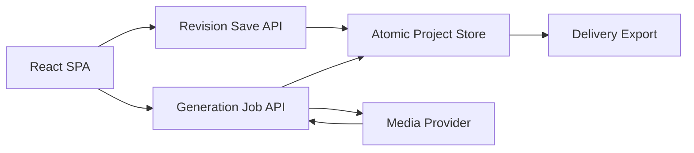

# 生产工作流设计

Feature Name: production-workflow
Updated: 2026-07-14

## 描述

本设计在现有 Express 文件存储和 React SPA 上增量增加版本化项目模型、统一资产与任务记录、稳定实体 ID、派生结果失效、分批分析和生产交付能力。

## 架构



## 组件和接口

- `normalizeProject(project)`：迁移历史结构、补齐稳定 ID、默认 revision 和生产字段。
- `saveProject(project, expectedRevision)`：原子写入并执行乐观并发控制。
- `PUT /api/projects/:id`：接收完整状态或字段 patch 与 `expectedRevision`。
- `POST /api/projects/:id/jobs`：创建项目级生成任务。
- `PATCH /api/projects/:id/jobs/:jobId`：更新任务状态并绑定资产。
- `GET /api/projects/:id/jobs`：恢复项目未完成任务。
- `GET /api/projects/:id/export-manifest`：导出生产清单。
- `GET /api/projects/:id/export-srt/:episode`：导出逐集字幕。

## 数据模型

```json
{
  "revision": 1,
  "sourceRevision": 1,
  "results": {
    "characters": { "characters": [{ "id": "char_x" }] },
    "scenes": { "scenes": [{ "id": "scene_x" }] },
    "storyboard": { "shots": [{ "id": "shot_x", "characterIds": [], "sceneId": "scene_x", "derivedFromRevision": 1 }] }
  },
  "assets": [{ "id": "asset_x", "entityType": "shot", "entityId": "shot_x", "kind": "video", "sourceRevision": 1 }],
  "jobs": [{ "id": "job_x", "entityId": "shot_x", "status": "processing", "providerTaskId": "..." }]
}
```

## 正确性属性

1. 每个实体 ID 在项目内唯一且重命名后保持不变。
2. 每个资产记录指向存在的项目和实体，历史资产保持不可变。
3. 每次成功保存只递增一次 revision，冲突保存不会覆盖服务端状态。
4. 任务完成更新使用实体 ID 定位，数组重排不改变目标。
5. 派生结果的 `derivedFromRevision` 小于当前来源 Revision 时标记为 stale。
6. 逐集 SRT 时间轴从零开始且时间单调递增。

## 错误处理

- Revision 冲突返回 HTTP 409 和最新项目。
- 原子写失败保留原项目文件并返回 HTTP 500。
- 媒体任务错误保存在任务记录中，前端显示可重试状态。
- 分块分析保存检查点，后续请求从失败分块继续。
- 历史项目迁移失败返回明确损坏信息并保留源文件。

## 测试策略

- 使用 Node 内置测试运行器验证项目迁移、ID 稳定性、revision 冲突、原子保存和 SRT 时间轴。
- 使用前端构建验证 JSX 与 API 接口。
- 使用 HTTP 集成测试验证项目保存、任务恢复和 manifest 导出。
